# Jeu piste 
## POSTMAN
### Requête GET 
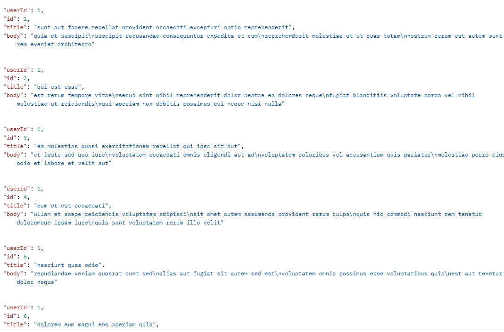

Voici le résultat eu en utilisant le lien données. 
1) Les réponses sont affichés sous forme de fichier JSON
2) La requête peut être sauvegarder dans un dossier en 
3) utilisant le bouton save en haut de l'écran 

### Requête POST
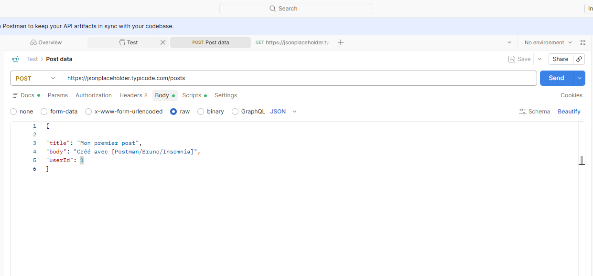

1) Ont peut ajouter des header en allant dans body et en 2) appuyant sur le bouton "raw" qui permet d'écrire de nouveau Headers. 

## BRUNO

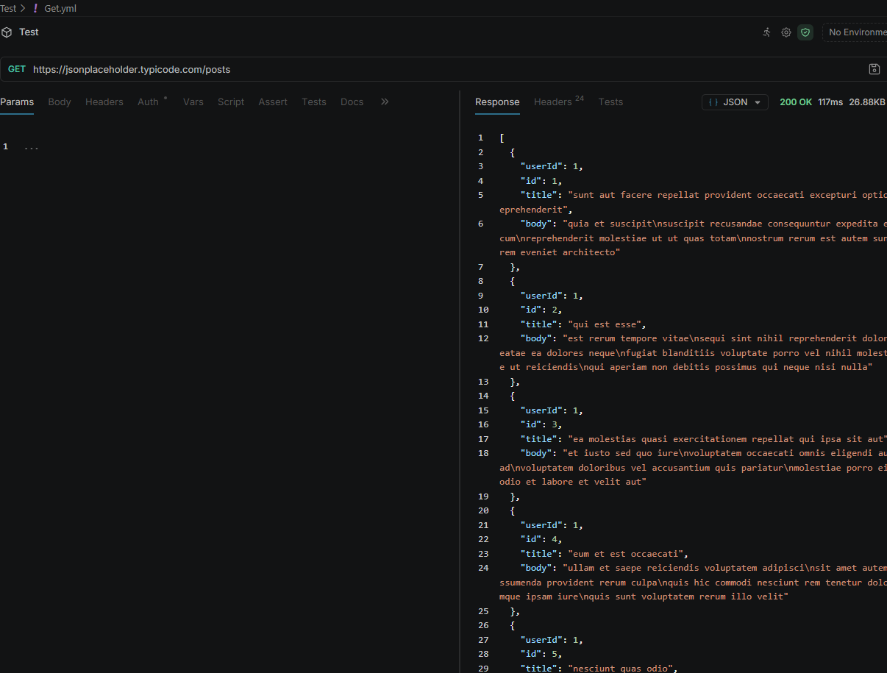

## Jeu de Piste Prof

### Etape 1
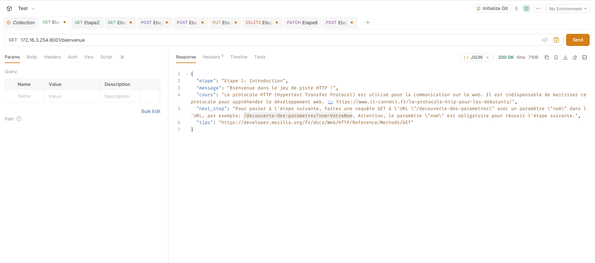

Il faut tout d'abord rentrer cette adresse en requette Get pour commencer, et ensuite appuyer sur le bouton "Send"

### Etape 2
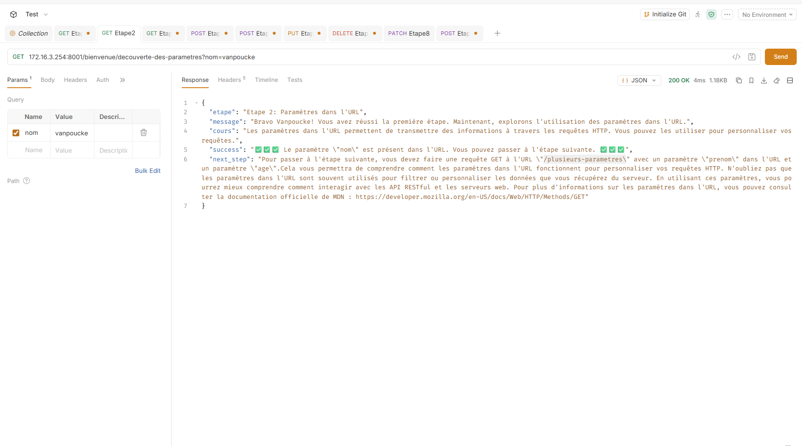

Pour la deuxième étape il fallait rajouter un paramètre dans l'url, le paramètre était nom. On peut rajouter un paramètre dans l'url grâce au symbole "?". 

### Etape 3

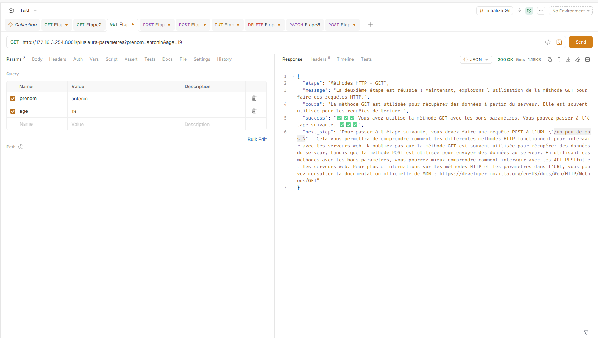

Pour la 3ème étape il fallait faire la même chose que l'étape numéro 2, rajouter un paramètre mais cette fois il faut rajouter deux paramètres, un paramètre "prenom" et un parametre "age". La différence c'est que pour ajouter deux paramètre le premier nous devons toujours rajouter "?" mais pour le deuxième paramètre il faut mettre "&".

### Etape 4
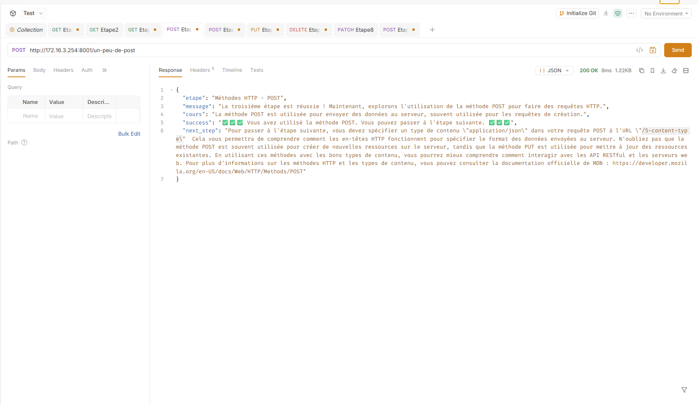

Pour la 4e étape, il fallait faire une requête POST. On constate qu'il ne se passe rien de spécial, ce qui est normal puisque nous n'avons rien ajouté ; la méthode POST sert principalement à ajouter des données

### Etape 5

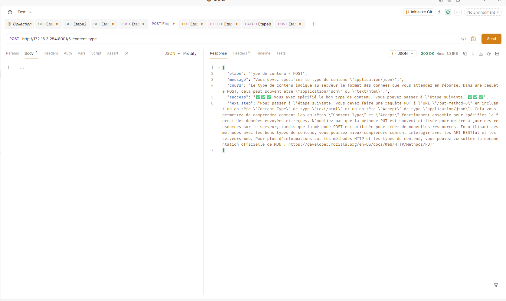

Pour la 5ème étape il fallait dire au logiciel dans quelle type de fichier nous voulons envoyer nos insformations, comme ont peut le voir je l'avais confirer en "JSON"
### Etape 6

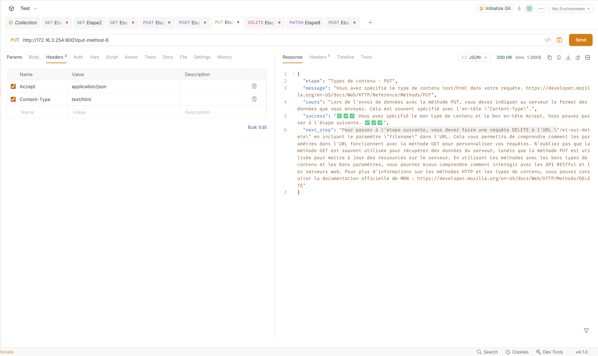

Pour la 6ème étape nous avons utilisé la méthode PUT, et j'ai rajouter des en tête "Accept" et "Content-type" qui ont comme value "Application/json" et "text/html"

### Etape 7

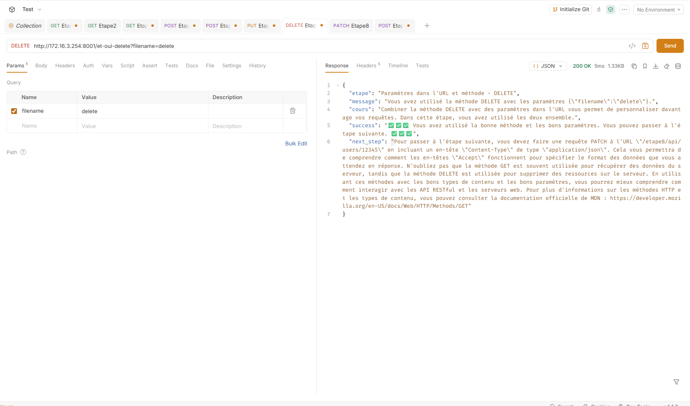

Pour cette 7ème étape nous avons utilisé la méthode DELETE, et j'ai rajouter un paramètre "delete" pour supprimer un fichier. La méthode "DELETE" est utilisé pour suprimer des ressources. 

### Etape 8

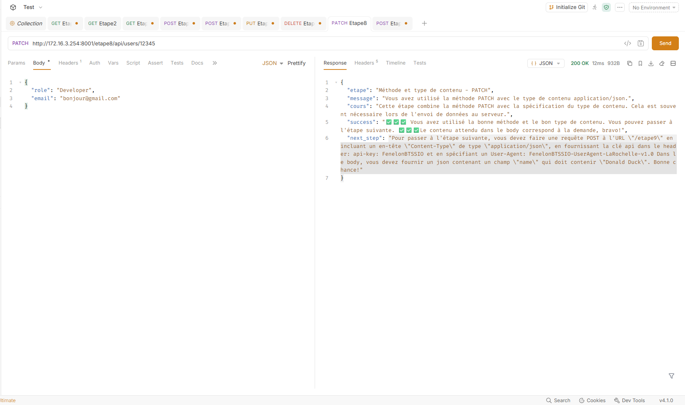

Pour cette 8ème étape, il fallait utilisé la méthode "PATCH" qui permet de modifier des ressources ou des informations. J'ai rajouter un Headers "Content-type" et comme value "application/json". Et dans le body j'ai ajouter les informations que je souhaite modifié. 

### Etape 9

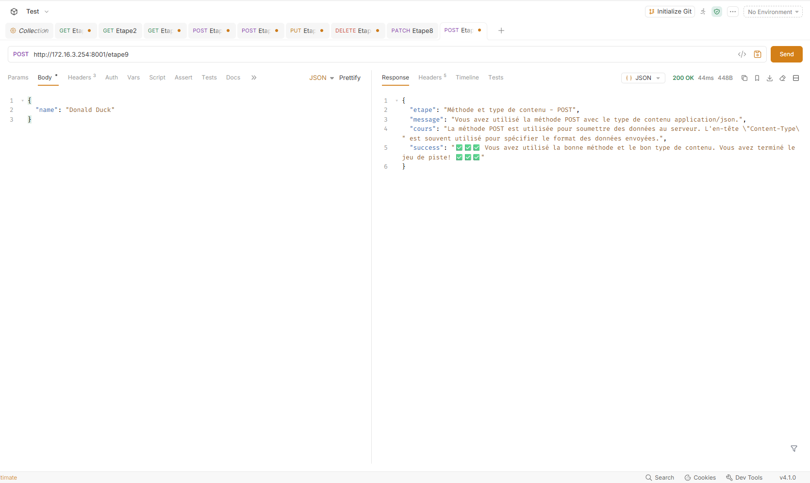
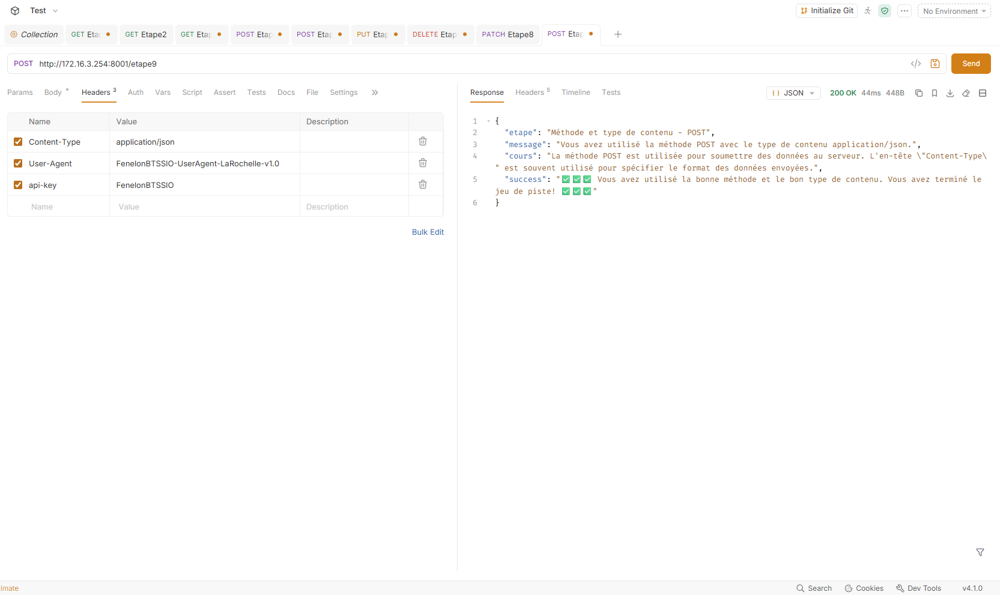

Pour cette dernière étape il fallait utilise la méthode POST, et ajouter des nouveaux headers "User-Agent" et "l'api-key"